# Markdown Syntax Showcase

## 10. Diagrams (Mermaid)

Visualizing data with diagrams.

### Flowchart


### Sequence Diagram

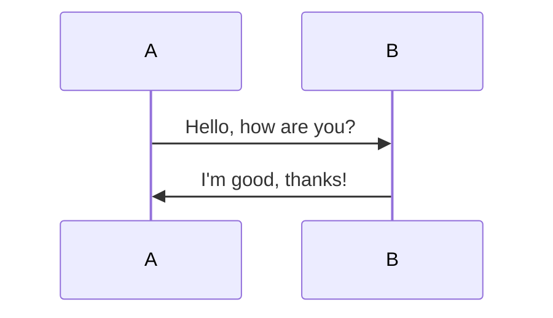

### Mindmap

```mindmap
- Root
  - Branch 1
    - Subbranch 1
    - Subbranch 2
  - Branch 2
    - Subbranch 3
    - Subbranch 4
```

### Chart (Gantt)

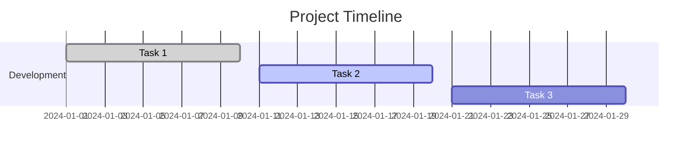

# Mermaid Diagrams Showcase

## 1. Flowchart

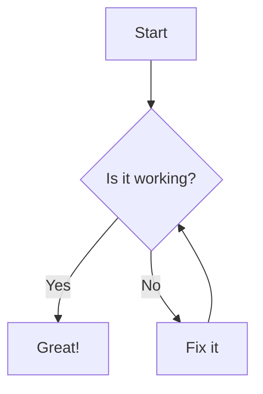

## 2. Sequence Diagram

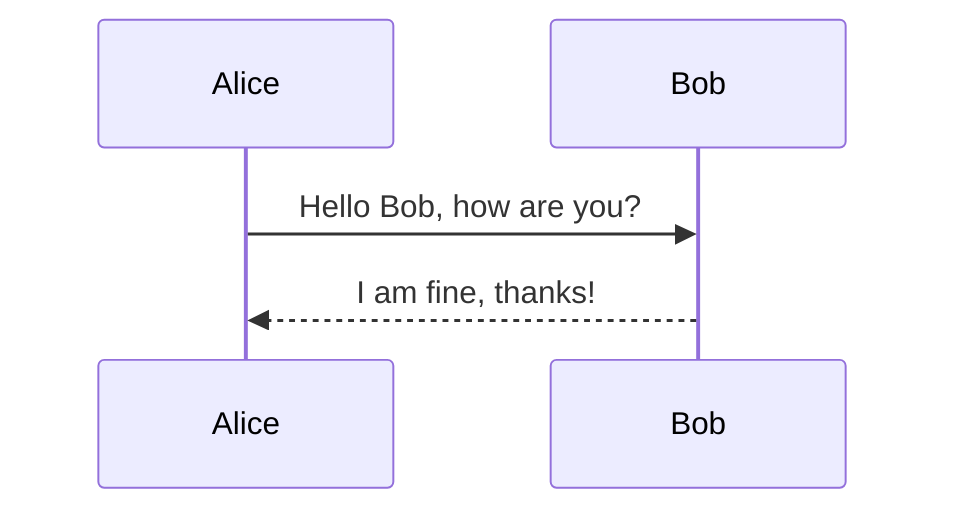

## 3. Class Diagram

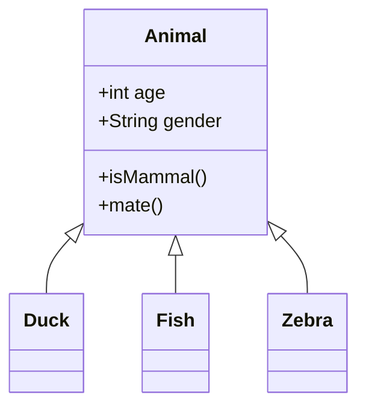

## 4. State Diagram

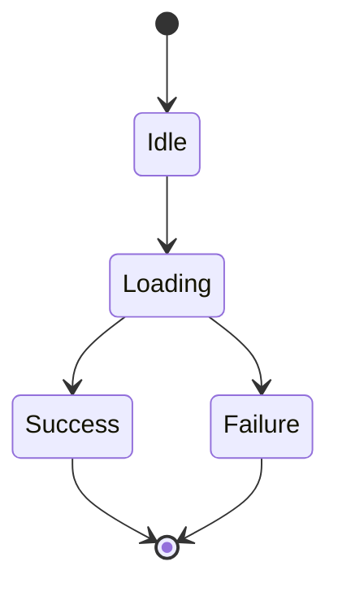

## 5. Gantt Chart

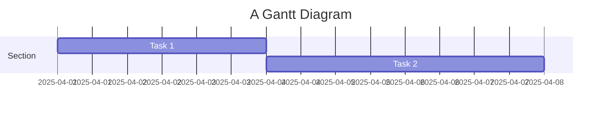

## 6. Pie Chart

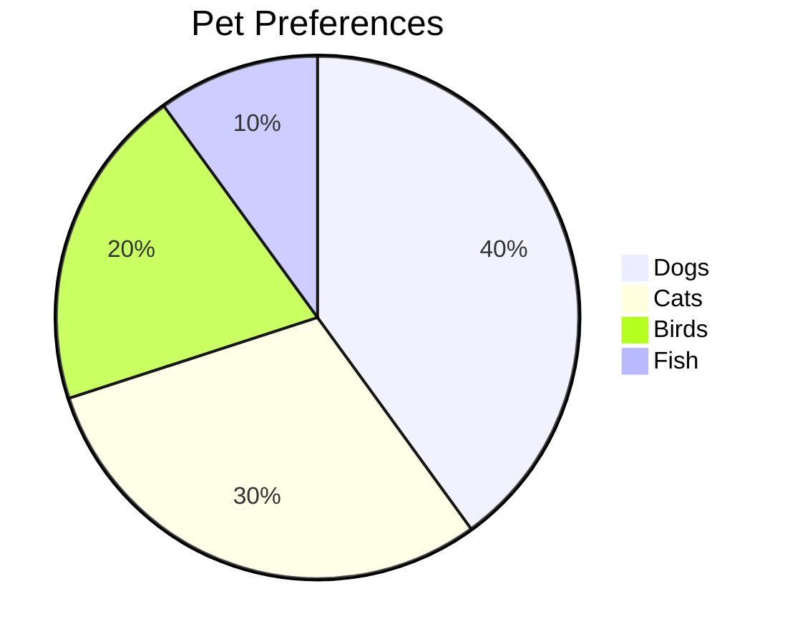

## 7. Git Graph

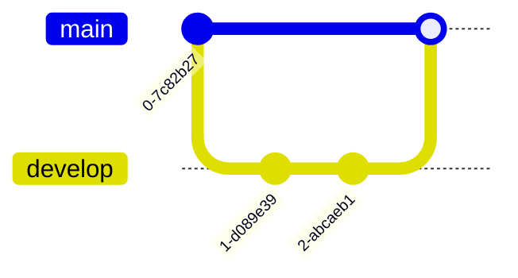

## 8. Entity Relationship Diagram (ERD)

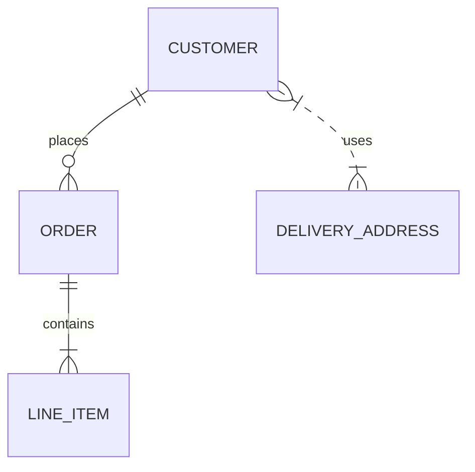

## 9. Journey Diagram

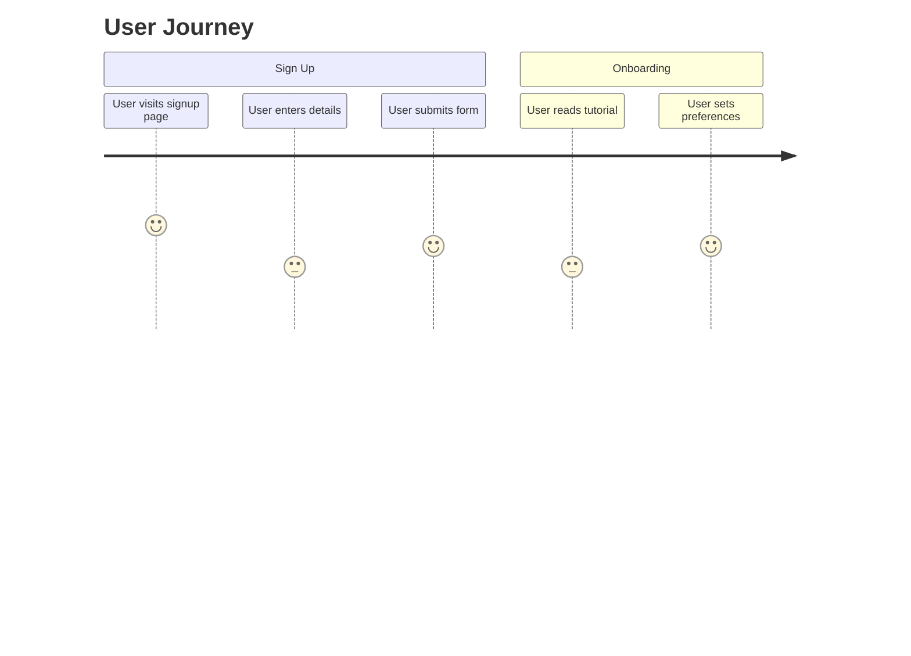

## 10. Requirement Diagram

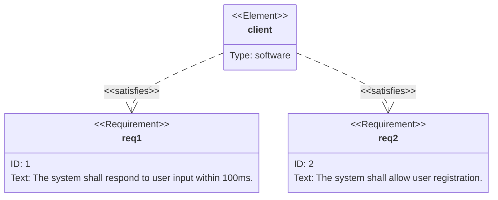

## 11. Mindmap

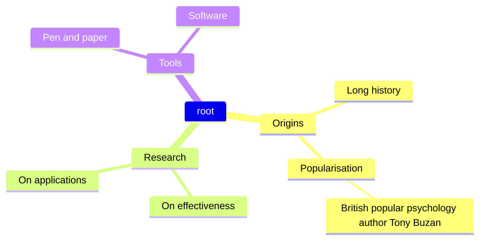

## 12. Quadrant Chart

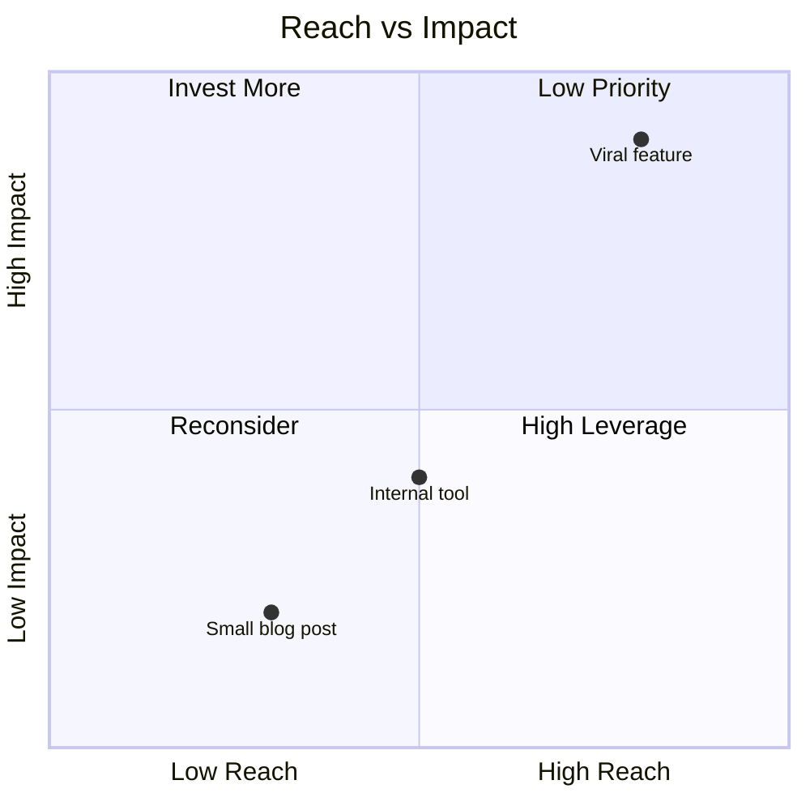
