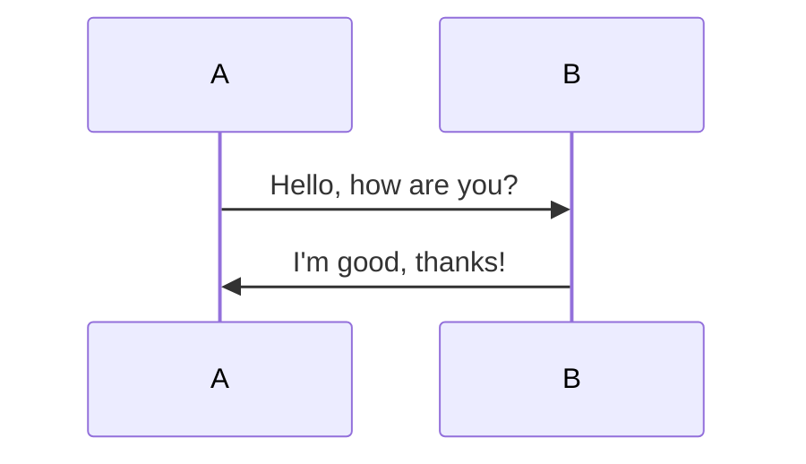
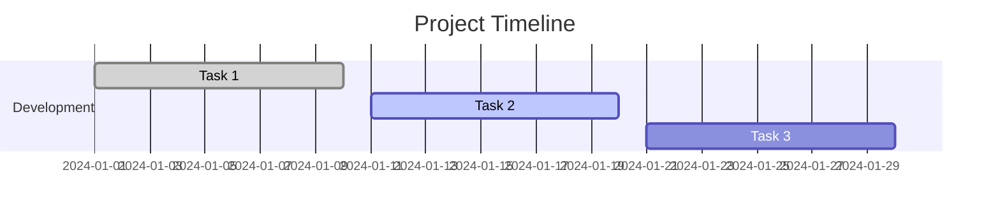

# Markdown Syntax Showcase

## 10. Diagrams (Mermaid)

Visualizing data with diagrams.

### Flowchart


### Sequence Diagram



### Mindmap

```mindmap
- Root
  - Branch 1
    - Subbranch 1
    - Subbranch 2
  - Branch 2
    - Subbranch 3
    - Subbranch 4
```

### Chart (Gantt)



## Images

Embedding images in Markdown.

SVG:


PNG:


Data URL:


